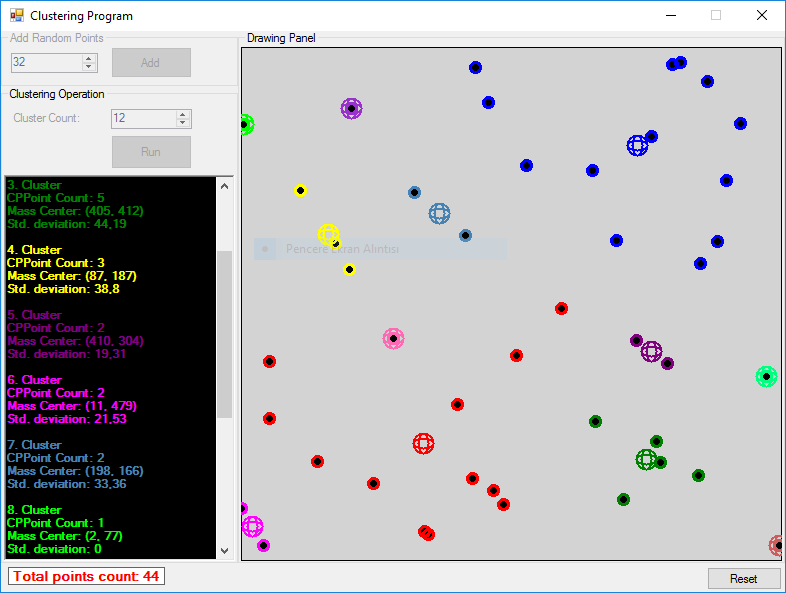

# Clustering Program
Single linkage clustering implementation based on Kruskal's MST algorithm.

## Features
* Users can add points manually or points can be added randomly.
* Users can get information for each cluster. (Point count per cluster, Mass center of points per cluster, Standard deviation of points per cluster)

## Screenshot

